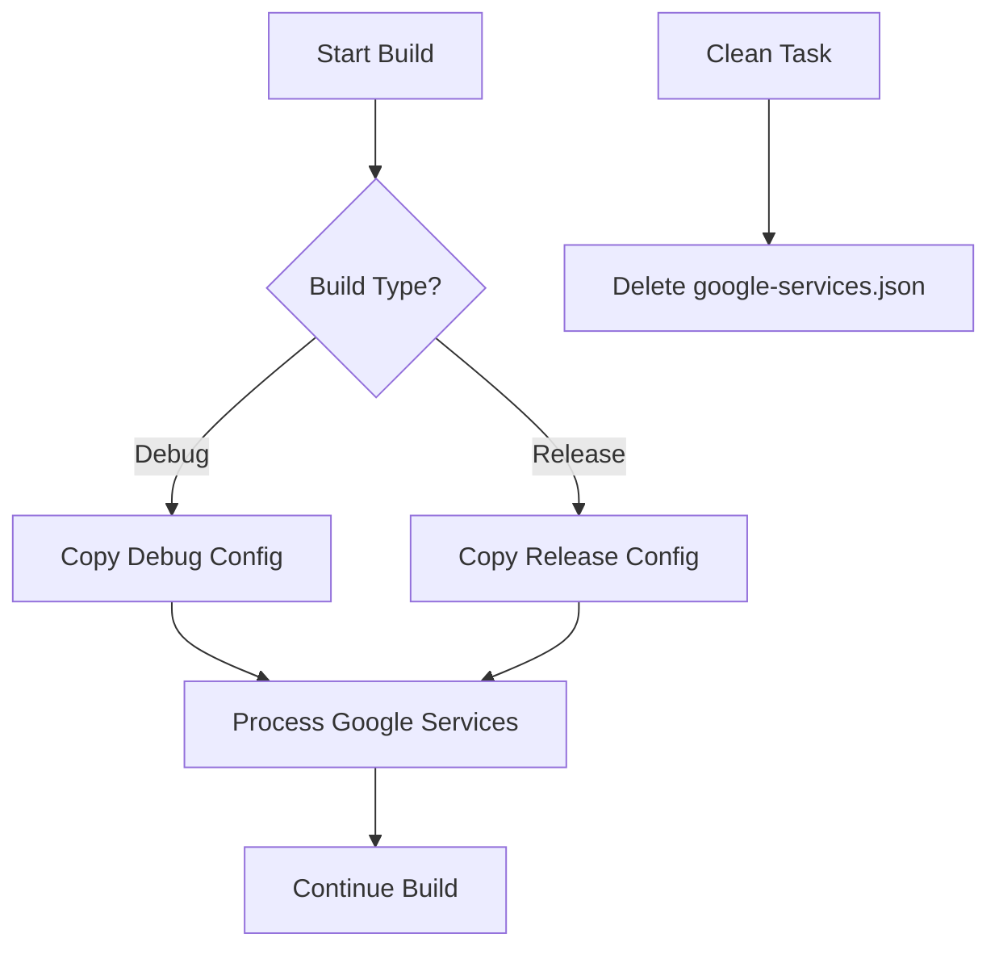

# Firebase Configuration Management

This document describes the automated Firebase configuration management system that supports different `google-services.json` files for debug and release builds.

## Project Structure

```
project-root/
├── firebase-configs/
│   ├── google-services-debug.json    # Debug Firebase configuration
│   └── google-services-release.json  # Release Firebase configuration
├── androidApp/
│   ├── build.gradle.kts              # Contains copy tasks
│   └── google-services.json          # Auto-generated (do not commit)
└── ...
```

## Configuration Files

### Debug Configuration (`firebase-configs/google-services-debug.json`)
- **Project ID**: `cibc-us-app-android-sample`
- **Package Name**: `com.cibc.us.app.android`
- **Purpose**: Development and testing
- **Features**: Debug-friendly settings, test data

### Release Configuration (`firebase-configs/google-services-release.json`)
- **Project ID**: `cibc-us-app-android-prod`
- **Package Name**: `com.cibc.us.app.android`
- **Purpose**: Production deployment
- **Features**: Production settings, real data

## Automated Copy System

### Gradle Tasks

#### 1. Copy Tasks
```kotlin
// Copy debug configuration
./gradlew copyGoogleServicesDebug

// Copy release configuration
./gradlew copyGoogleServicesRelease

// Clean up google-services.json
./gradlew cleanGoogleServices
```

#### 2. Automatic Build Integration
The system automatically copies the appropriate configuration file based on the build type:

- **Debug Builds**: Automatically uses `google-services-debug.json`
- **Release Builds**: Automatically uses `google-services-release.json`

### Build Process Flow



## Usage Examples

### Building Debug Version
```bash
# Automatically uses debug configuration
./gradlew assembleDebug

# Or explicitly copy debug config first
./gradlew copyGoogleServicesDebug assembleDebug
```

### Building Release Version
```bash
# Automatically uses release configuration
./gradlew assembleRelease

# Or explicitly copy release config first
./gradlew copyGoogleServicesRelease assembleRelease
```

### Manual Configuration Management
```bash
# Copy specific configuration manually
./gradlew copyGoogleServicesDebug
./gradlew copyGoogleServicesRelease

# Clean up
./gradlew cleanGoogleServices
```

## Task Dependencies

The build system automatically handles task dependencies:

1. **Before Google Services Processing**: Appropriate config file is copied
2. **Clean Task**: Removes `google-services.json` file
3. **Build Tasks**: Automatically trigger config copy based on build type

## Configuration File Format

Both configuration files follow the standard Firebase format:

```json
{
  "project_info": {
    "project_number": "PROJECT_NUMBER",
    "project_id": "PROJECT_ID",
    "storage_bucket": "PROJECT_ID.appspot.com"
  },
  "client": [
    {
      "client_info": {
        "mobilesdk_app_id": "MOBILE_SDK_APP_ID",
        "android_client_info": {
          "package_name": "com.cibc.us.app.android"
        }
      },
      "oauth_client": [...],
      "api_key": [...],
      "services": {...}
    }
  ],
  "configuration_version": "1"
}
```

## Setup Instructions

### 1. Replace Sample Configurations

#### For Debug Environment:
1. Create a Firebase project for development
2. Add Android app with package name: `com.cibc.us.app.android`
3. Download `google-services.json`
4. Replace `firebase-configs/google-services-debug.json`

#### For Production Environment:
1. Create a Firebase project for production
2. Add Android app with package name: `com.cibc.us.app.android`
3. Download `google-services.json`
4. Replace `firebase-configs/google-services-release.json`

### 2. Verify Configuration
```bash
# Test debug build
./gradlew assembleDebug

# Test release build
./gradlew assembleRelease

# Check which config is active
cat androidApp/google-services.json | grep project_id
```

## Git Configuration

### .gitignore Entries
```gitignore
# Auto-generated Firebase config (do not commit)
androidApp/google-services.json

# Keep the source configurations
!firebase-configs/google-services-*.json
```

### Recommended Workflow
1. **Commit**: Source configuration files in `firebase-configs/`
2. **Ignore**: Auto-generated `androidApp/google-services.json`
3. **Build**: Let Gradle tasks handle copying automatically

## Troubleshooting

### Common Issues

#### 1. Configuration Not Found
```
Error: google-services.json not found
```
**Solution**: Run the appropriate copy task manually:
```bash
./gradlew copyGoogleServicesDebug  # for debug
./gradlew copyGoogleServicesRelease  # for release
```

#### 2. Wrong Configuration Active
**Check current config**:
```bash
cat androidApp/google-services.json | grep project_id
```

**Force correct config**:
```bash
./gradlew cleanGoogleServices copyGoogleServicesDebug
```

#### 3. Build Cache Issues
**Clean and rebuild**:
```bash
./gradlew clean build
```

### Debug Commands
```bash
# List available tasks
./gradlew tasks --group="other"

# Check task dependencies
./gradlew assembleDebug --dry-run

# Verify file copying
ls -la androidApp/google-services.json
ls -la firebase-configs/
```

## Security Considerations

1. **Source Control**: 
   - Commit configuration files in `firebase-configs/`
   - Never commit auto-generated `androidApp/google-services.json`

2. **Access Control**:
   - Restrict access to production configuration files
   - Use different Firebase projects for debug/release

3. **API Keys**:
   - Rotate API keys regularly
   - Monitor Firebase console for unusual activity

## Advanced Configuration

### Custom Build Types
To support additional build types (e.g., staging):

1. **Add configuration file**:
   ```
   firebase-configs/google-services-staging.json
   ```

2. **Add copy task**:
   ```kotlin
   tasks.register<Copy>("copyGoogleServicesStaging") {
       from("${rootProject.projectDir}/firebase-configs/google-services-staging.json")
       into("${projectDir}")
       rename("google-services-staging.json", "google-services.json")
   }
   ```

3. **Add build type dependency**:
   ```kotlin
   tasks.matching { it.name.contains("processStagingGoogleServices") }.configureEach {
       dependsOn("copyGoogleServicesStaging")
   }
   ```

### Environment Variables
For CI/CD environments, you can override configurations:

```bash
# Set environment-specific config
export FIREBASE_CONFIG_TYPE=release
./gradlew copyGoogleServices${FIREBASE_CONFIG_TYPE^} assembleRelease
```

## Benefits

1. **Automated**: No manual file copying required
2. **Build-Type Aware**: Automatically selects correct configuration
3. **Clean Separation**: Debug and production configs are isolated
4. **Version Control Friendly**: Source configs are tracked, generated files are ignored
5. **CI/CD Ready**: Works seamlessly in automated build environments
